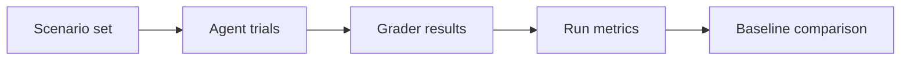

# SynthArena

### Measure what changed when an AI agent changes.

A successful demo answers whether an agent can finish a task once. An evaluation needs to explain which scenarios improved, which regressed, how much they cost, and whether the scoring rule itself is trustworthy.

SynthArena is a **TypeScript workspace for agent-evaluation experiments**: scenario generation and loading, composable graders, repeated trials, regression comparisons, and token-cost analysis.

**Start with:** [graders](packages/core/src/graders.ts) · [evaluation loop](packages/core/src/evaluate.ts) · [regression comparison](packages/replay/src/regression.ts) · [scenario tests](packages/scenarios/src/)

## The evaluation loop



| Component | Engineering focus | Source |
| --- | --- | --- |
| Scenarios | Loading, generation, templates, and quality checks | [`packages/scenarios`](packages/scenarios/) |
| Graders | Content checks, token/cost/latency thresholds, state differences, and policy criteria | [`packages/core/src/graders.ts`](packages/core/src/graders.ts) |
| Evaluation | Trial orchestration and aggregation of scenario results | [`packages/core/src/evaluate.ts`](packages/core/src/evaluate.ts) |
| Regression analysis | Compare run outcomes, identify new failures, and track cost and latency deltas | [`packages/replay`](packages/replay/) |
| Cost modeling | Estimate token costs using configured model prices | [`packages/cost`](packages/cost/) |
| Shared contracts | Types connecting scenarios, agents, scorers, and evaluation runs | [`packages/shared`](packages/shared/) |

A grader result is evidence under a particular scoring rule. It does not establish general agent reliability, safe sandbox isolation, or correctness in a different environment. Model-based graders and provider adapters require separate configuration and validation; cost estimates depend on the configured prices.

## Explore locally

Use **Node.js 22** and **pnpm 9.15.0**. These commands run focused package tests with local fixtures.

```bash
git clone https://github.com/asquitt/synth-arena.git
cd synth-arena
pnpm install --lockfile=false --ignore-scripts
pnpm test:core
pnpm test:scenarios
```

The committed workspace lockfile is currently out of sync with package manifests. The install command above resolves those manifests for local exploration without rewriting the lockfile; it is not a reproducible release install.

For a small entry point, read [grader tests](packages/core/src/graders.test.ts), [scenario loader tests](packages/scenarios/src/loader.test.ts), and [regression tests](packages/replay/src/regression.test.ts) alongside their implementations.

This repository is intended for source exploration and controlled local evaluation, rather than a standalone hosted service. Runtime and release controls remain defined by `PROJECT_STATUS.json`. Package publication and automatic deployment are separate from making the source readable on GitHub.

## Design questions worth exploring

- Which assertions should be deterministic, and which need a model judge?
- How do you separate a changed scenario from a changed agent?
- When does an aggregate score hide a newly introduced failure?
- How should evaluation quality trade off against token cost and latency?

## Discuss or contribute

Interested in small reproducible scenarios, grader failure cases, and better ways to explain regressions. Include the scenario, expected result, scorer definition, and a fixture-based test when proposing a change.

Built by [Demario Asquitt](https://github.com/asquitt). [More projects](https://github.com/asquitt#selected-work).
